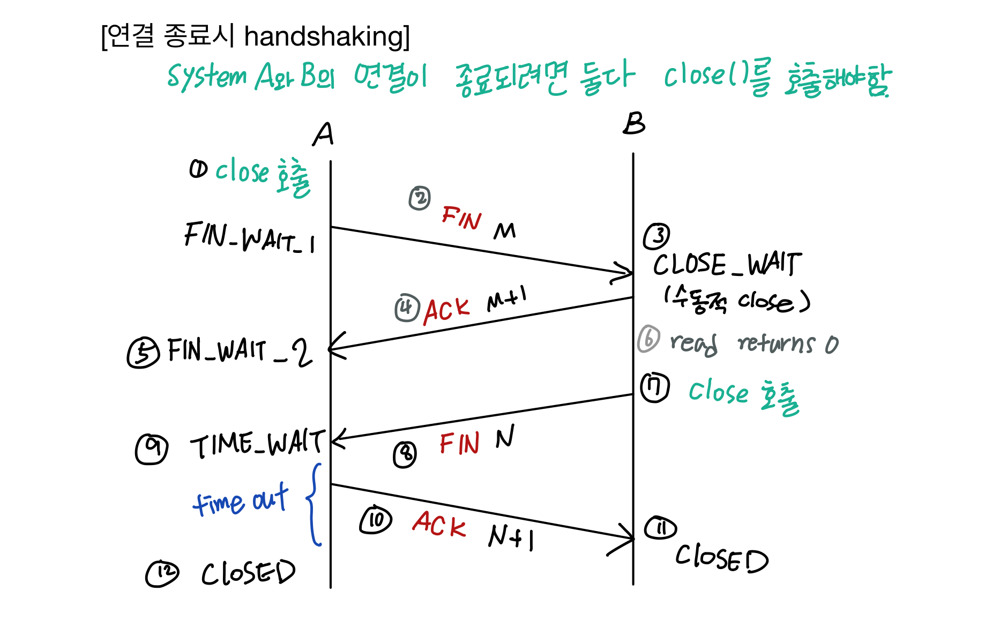

> 간단한 서버와 클라이언트 코드를 통해 소켓 통신의 기본적인 원리를 알아본다.

> 테스트방법
```shell
$ gcc -Wall -Werror -Wextra server.c -o server
$ gcc -Wall -Werror -Wextra client.c -o client
./server

```

```shell
# 다른 콘솔에서
./client
received Data : hello, world
```

## 1. 서버 사이드의 전체적인 흐름 (전화기에 비유)

1) 소켓을 생성 (전화기를 만드는 것에 비유할 수 있음) `socket()`

2) 연결 요청을 수신할 주소 설정

3) 소켓을 포트에 연결 (전화기에 전화번호 할당) `bind()`

4) 커널(kernal)에 개통 요청 (실제로 전화를 받을 수 있게 전화선 연결) `listen()`

> while() 문 돌면서 클라이언트의 연결 요청을 기다린다.
5) 클라이언트 연결 요청 수신 `accept()`  
6) 클라이언트 요청 서비스 제공 `read()` / `write()`  
7) 클라이언트와 연결 종료 `close()`  

8) 서버 종료

전체 흐름을 이해하는 데 도움이 되는 링크  
* [Socket Programming in C/C++](https://www.geeksforgeeks.org/socket-programming-cc/)
* [How to build a simple HTTP server](https://medium.com/from-the-scratch/http-server-what-do-you-need-to-know-to-build-a-simple-http-server-from-scratch-d1ef8945e4fa)
* * *

## 2. 각 단계 자세히 알아보기
> 각 단계에서 사용하는 함수와, 알아야할 개념을 하나씩 짚어본다.  

### 1) 소켓 생성 `socket()`
system call인 socket() 은 통신을 위한 endpoint를 생성하고 생성된 소켓에 해당하는 file descriptor를 반환한다.
```c
#include <sys/types.h>
#include <sys/socket.h>

int socket(int domain, int type, int protocol);
```
**return value**

* -1 이 반환되면 소켓 생성 실패, 0 이상의 값이 나오면 socket descriptor 반환.
* 소켓을 통해 통신하는 방식은 파일에 쓰고 읽는 방식이라 소켓 디스크립터도 파일 디스크립터와 같다고 보면 된다.

**domain:** communication domain(어떤 영역에서 통신할 것인지)

* PF_INET (IPv4 protocol)
* PF_INET6 (IPv6 protocol)
* AF_INET (IPv4 protocol)
* AF_INET6 (IPv6 protocol)

> PF_INET은 프로토콜 패밀리, AF_INET은 주소 패밀리이다. 
> 둘의 차이는 [여기](https://www.bangseongbeom.com/af-inet-vs-pf-inet.html) 참조

**type:** communication type(어떤 방식으로 통신할 것인지)

* SOCK_STREAM: TCP(reliable, connection oriented)
* SOCK_DGRAM: UDP(unreliable, connectionless)

**protocol:** 어떤 프로토콜을 사용할 것인지

* Internet Protocol(IP)를 쓸 땐 0. 
  * 패킷의 IP 헤더에서 프로토콜 필드값인 0과 같은 숫자임.
* TCP일 땐 IPPROTO_TCP
* UDP일 땐 IPPROTO_UDP

[socket 함수 Ref](https://man7.org/linux/man-pages/man2/socket.2.html)  

+) 더 알아보기  
<details>
<summary>setsockopt 함수</summary>
setsockopt 함수는 소켓의 세부설정을 가능하게 하는 함수이다.
webserv 과제에서 이 함수를 아래와 같이 사용한다.  
```
setsockopt(_fd, SOL_SOCKET, SO_REUSEADDR, &yes, sizeof(int))
```   
`TIME_WAIT` 상태에서도 포트번호를 재할당할수 있도록 SO_REUSEADDR 옵션을 1로 설정한다는 의미인데...  

이걸 왜 해야되냐면?  

server 에서 먼저 close()를 호출할 경우 아래와 같은 연결 종료 handshaking 과정을 거친다.


여기서 TIME_WAIT 상태일 때 bind()를 시도하면, 같은 주소에 또 다른 소켓이 연결을 시도하므로 에러가 발생한다.  
TIME_WAIT 상태에서도 포트번호를 재사용할 수 있도록 SO_REUSEADDR 옵션을 설정해 소켓의 속성을 변경해준다.  
[setsockopt 함수 Ref](https://jhnyang.tistory.com/262)   
[SO_REUSEADDR Ref](https://m.blog.naver.com/PostView.nhn?blogId=cache798&logNo=130080237440&proxyReferer=https:%2F%2Fwww.google.com%2F)
</details>

* * *

### 2) 연결 요청을 수신할 주소 설정
* 주소체계와 `sockaddr_in` 구조체에 대하여.  
흔히 생각하는 IP주소에는 포트번호가 포함되어 있지 않다. 하지만 목적지에 제대로 도착하려면 IP주소+포트번호가 필요하다. IPv4와 IPv6 에 따라 다른 데이터 타입을 쓰는데, 이를 편하게 하기 위해 주소 체계를 구조체로 만들어 놓은 것이다. 주소구조체의 종류에는 여러가지가 있는데, `sockaddr_in`은 IPv4에 해당하는 주소 체계를 담는 구조체이다. 구성은 아래와 같다. 그리고 `sockaddr` 구조체는 소켓의 구조를 담는 기본적인 틀의 역할을 한다. 
뒤에 나올 `bind()`, `accecpt()`, `connect()` 와 같은 함수에서 `(struct sockaddr *)`으로 형변환한 값을 받는 것을 볼 수 있다.
```c
#include <netinet/in.h>

struct sockaddr_in {
	sa_family_t		sin_family; // 주소 체계. sockaddr_in은 IPv4를 위한 주소체계이므로, AF_INET을 넣어주면 된다.
	uint16_t		sin_port; // 16비트 TCP / UDP port
	struct in_addr		sin_addr; // 32비트 IPv4 주소
	char			sin_zero[8]; // 사용되지 않음.
};
```

* 연결 요청을 수신할 주소를 설정하는 코드는 다음과 같다.  
```c
struct sockaddr_in s_addr;

memset(&s_addr, 0, sizeof(s_addr));
s_addr.sin_family = AF_INET;
s_addr.sin_port = htons(PORT);
s_addr.sin_addr.s_addr = htonl(INADDR_ANY);
```
`htonl()` 함수와 `htons()` 함수를 사용하고 있는 걸 볼 수 있는데,  
sockaddr_in 구조체의 변수에 값을 대입할 때는 Network-btye Ordering(네트워크 바이트 순서)로 값을 변경한 다음 대입해야한다.
#### 바이트 순서란?
바이트 순서는 시스템이 내부적으로 데이터를 저장하는 방법을 의미하며, 크게 Big-Endian과 Little-Endian 방식으로 나뉜다.
* Big-Endian
	- 상위 바이트 값이 메모리 상의 번지수가 작은 위치에 저장되는 순서
	- 16진수 "4F52"를 (낮은 주소)4F52(높은 주소)로 저장
* Little-Endian
	- 하위 바이트 값이 메모리 상의 번지수가 작은 위치에 저장되는 순서
	- 16진수 "4F52"를 (낮은 주소)524F(높은주소)로 저장

시스템의 CPU에 따라 Big-Endian을 쓰는지 Little-Endian을 쓰는지가 달라지고, 이를 Host-byte Order(호스트 바이트 순서)라고 한다.
네트워크 통신의 경우, 두 시스템의 바이트 순서가 다르면 데이터를 주고 받을 때 문제가 발생할 수 있기 때문에 반드시 네트워크 바이트 순서로 통일해야한다. 이를 위해 `htonl()`, `htons()` 함수를 이용해 데이터를 변환해주는 것이다.

```
h: host byte order
n: network byte order
s: short (16bit)
l: long (32bit)

unsigned short htons(unsigned short); // host to network short
unsigned short ntohs(unsigned short); // network to host short
unsigned long htonl(unsigned long); // host to network long
unsigned long ntohl(unsigned long); // network to host long
```

[주소체계 Ref](https://jhnyang.tistory.com/261)  
+) 더 알아보기  
[요청을 수신할 주소 설정시 INADDR_ANY의 의미](http://grindawayat.blogspot.com/2015/05/inaddrany.html)

### 3) 소켓을 포트에 연결 `bind()`
소켓이 생성되고 주소를 설정해주면, 해당 소켓은 위에서 설정한대로 주소에 대한 정보값만 갖고 있는 상태가 되는데, 이 정보를 실제 포트와 연결시키려면 bind() 함수를 이용해야 한다.  

bind() 함수 원형
```c
#include <sys/socket.h>

int bind(int sockfd, struct sockaddr *myaddr, int addrlen);
```

### 4) 커널(kernal)에 개통 요청 `listen()`

```c
#include <sys/socket.h>

int listen(int sockfd, int backlog);
```
**backlog :** 대기열에 들어올 수 있는 연결 요청의 개수를 제한한다. queue가 꽉 찬 상태에서 연결 요청이 들어오면, 클라이언트는 ECONNREFUSED 메시지와 함께 에러를 반환받는다.  

> 5\) ~ 7) while 문 돌면서 클라이언트의 연결 요청을 기다린다.

### 5) 클라이언트에서 연결 요청이 오면 수락 `accept()`
accept() 함수는 아직 처리되지 않은 연결들이 대기하고 있는 큐에서 제일 처음 연결된 연결을 가져와서 새로운 연결된 소켓을 만든다. 그리고 소켓을 가리키는 fd를 할당하고 이것을 리턴한다. 리턴되는 소켓은 client 의 소켓이 된다.
```c
#include <sys/socket.h>

int accept(int sockfd, struct sockaddr *addr, int *addrlen);
```

**return value**  
에러시 -1이 반환된다. 성공한다면 받아들인 소켓을 위한 fd를 반환한다.

**sockfd**  
socket() 로 만들어진 end-point(듣기 소켓)을 위한 file descriptor.

**addr**    
sockaddr 구조체에 대한 포인터. 연결이 성공되면 이 구조체를 채워서 되돌려 주게 되고, 우리는 이 구조체의 정보를 이용해서 연결된 **클라이언트의** 인터넷 정보를 알아낼수 있다.

**addrlen**    
addr의 크기

[accept Ref](https://www.joinc.co.kr/w/man/2/accept)

### 6) 클라이언트 요청 서비스 제공 `read()` / `write()`  
> 현재 sample server 코드에서는 클라이언트 소켓 descriptor 에 buffer 내용을 write 함

### 7) 클라이언트와 연결 종료 `close()`  
열린 파일(디스크립터)을 닫을 때 사용
```c
#include <unistd.h>

int	close(int fildes);
```

### 8) 서버 종료 `close()`

* * *

## 3. 소켓 통신 테스트해보기
* 이렇게 만든 서버에 `nc localhost 9000`으로 연결 요청을 해볼 수 있다.
* 클라이언트 프로그램을 직접 작성해서 연결 요청을 보내볼 수도 있다.
